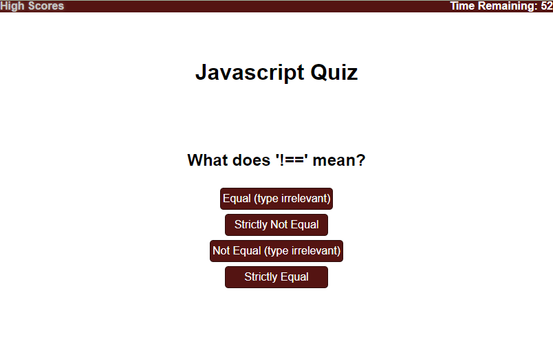

# WebAPI Challenge - Javascript Quiz

## **Description**

This was the second Javascript project we were given and I felt a LOT more comfortable coding with Javascript than the last project. This was still quite a challenge though. I put in about 10 hours or more into completing this so I hope you enjoy it! 

---

## **Acceptance Criteria**
```
GIVEN I am taking a code quiz
WHEN I click the start button
THEN a timer starts and I am presented with a question
WHEN I answer a question
THEN I am presented with another question
WHEN I answer a question incorrectly
THEN time is subtracted from the clock
WHEN all questions are answered or the timer reaches 0
THEN the game is over
WHEN the game is over
THEN I can save my initials and my score
```
---

## **Preview**


---

## **Usage & Live Link**

To view/use this project, it can be accessed by going to [https://jwatkins28.github.io/Javascript-Quiz/](https://jwatkins28.github.io/Javascript-Quiz/). Feel free to utilize the quiz if it helps you at all! If you'd like to view the code you can use the DevTools in your browser or view the files in the repository. 

---

## **Credits**

- UT Bootcamp
- Nikki and the TA's
- Myself 😁 

---
